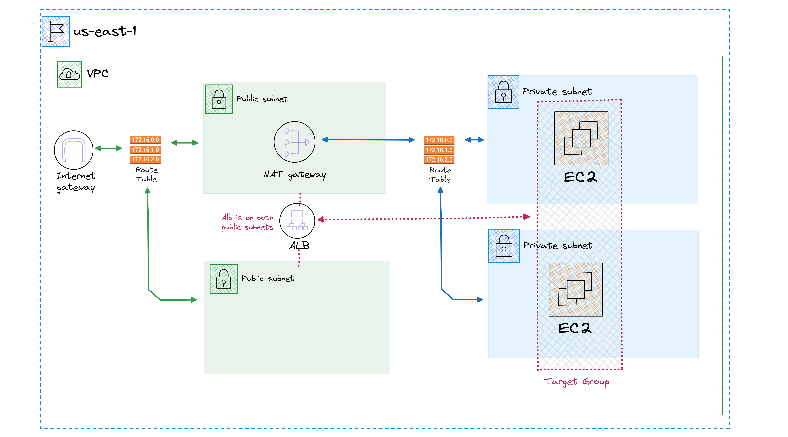
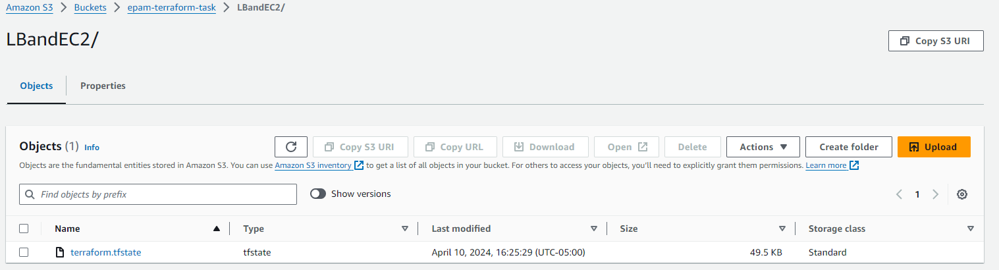
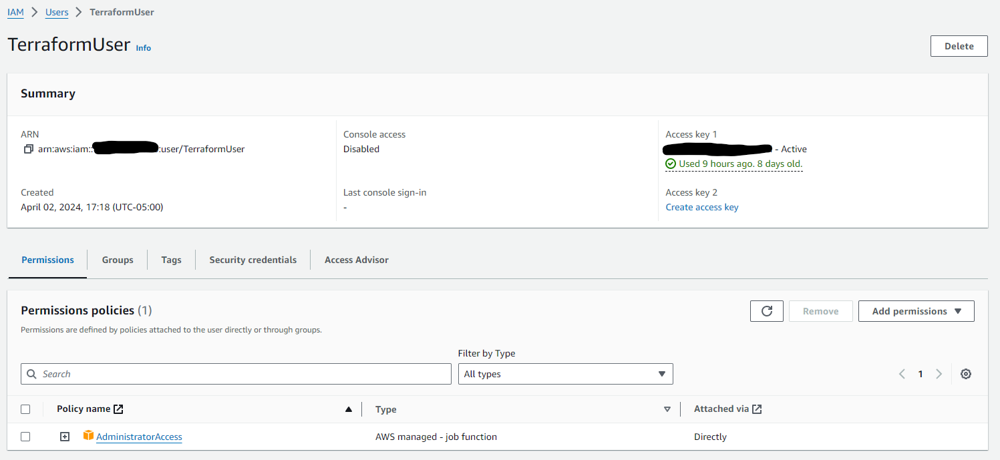
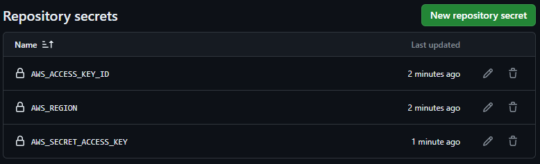

# ALB with EC2 Instances

Build using terraform v1.7.5

by: Juan Manuel De La Torre Sanchez

## Diagram



## Table of Contents
- [Project Structure](#project-structure)
- [AWS Setup](#aws-setup)
    - [Create S3 Bucket and DynamoDB table](#create-s3-bucket-and-dynamodb-table)
    - [Create an user for Terraform (Optional)](#create-an-user-for-terraform-optional)
- [Deploy](#deploy)
    - [Local](#local)
    - [GHA](#gha)

## 🚀 Project Structure

```text
/
├── .github/
│   └── workflows/
│       └── deploy.yml
└── terraform/
    ├── backend.tf
    ├── network.tf
    ├── main.tf
    ├── outputs.tf
    ├── provider.tf
    └── http_install.sh
```

## AWS Setup

### Create S3 Bucket and DynamoDB table

For storing the state in remote we need to create an S3 bucket and a DynamoDB table, then add them to thew backend.tf file




### Create an user for terraform (Optional)

This one is not mandatory, you can use your personal AWS credentials, but for consistency, i created a new user and then the access keys in this User

This one have administrative access so it can create almost everything but it is better to adjust the policies to the specific resources that Terraform will have access



## Deploy

### Local

Setup the credentials for AWS (check provider.tf and backend.tf) then use 

```sh
terraform init #for backend init and config of providers
terraform plan # Check what is going to happen
terraform apply # apply changes
```

### GHA

Just make a commit to the main branch of this repository and adjust the secrets with the credentials 

